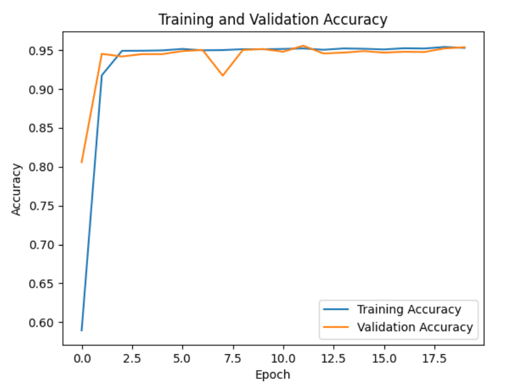

# EX-04 - Deep Neural Network for Malaria Infected Cell Recognition

<p align="center">

</p>

## Project Description

Malaria is a deadly disease caused by the Plasmodium parasite transmitted through the bite of infected mosquitoes. It poses a significant global health threat, particularly in regions with limited access to healthcare resources. One of the critical aspects of combating malaria is the early and accurate diagnosis of infected individuals. Microscopic examination of blood smears is the gold standard for malaria diagnosis, but it can be time-consuming and requires skilled technicians. To address this challenge, we aim to develop a deep neural network for Malaria infected cell recognition.

## Problem Statement

The problem at hand is the automatic classification of red blood cell images into two categories: parasitized and uninfected. Malaria-infected red blood cells, known as parasitized cells, contain the Plasmodium parasite, while uninfected cells are healthy and free from the parasite. The goal is to build a convolutional neural network (CNN) model capable of accurately distinguishing between these two classes based on cell images.

Traditional methods of malaria diagnosis involve manual inspection of blood smears by trained professionals, which can be time-consuming and error-prone. Automating this process using deep learning can significantly speed up diagnosis, reduce the workload on healthcare professionals, and improve the accuracy of detection.

Our dataset comprises 27,558 cell images, evenly split between parasitized and uninfected cells. These images have been meticulously collected and annotated by medical experts, making them a reliable source for training and testing our deep neural network.

## Neural Network Model:


## Design Steps

### Step 1: Import Libraries

We begin by importing the necessary Python libraries, including TensorFlow for deep learning, data preprocessing tools, and visualization libraries.

### Step 2: Allow GPU Processing

To leverage the power of GPU acceleration, we configure TensorFlow to allow GPU processing, which can significantly speed up model training.

### Step 3: Read Images and Check Dimensions

We load the dataset, consisting of cell images, and check their dimensions. Understanding the image dimensions is crucial for setting up the neural network architecture.

### Step 4: Image Generator

We create an image generator that performs data augmentation, including rotation, shifting, rescaling, and flipping. Data augmentation enhances the model's ability to generalize and recognize malaria-infected cells in various orientations and conditions.

### Step 5: Build and Compile the CNN Model

We design a convolutional neural network (CNN) architecture consisting of convolutional layers, max-pooling layers, and fully connected layers. The model is compiled with appropriate loss and optimization functions.

### Step 6: Train the Model

We split the dataset into training and testing sets, and then train the CNN model using the training data. The model learns to differentiate between parasitized and uninfected cells during this phase.

### Step 7: Plot the Training and Validation Loss

We visualize the training and validation loss to monitor the model's learning progress and detect potential overfitting or underfitting.

### Step 8: Evaluate the Model

We evaluate the trained model's performance using the testing data, generating a classification report and confusion matrix to assess accuracy and potential misclassifications.

### Step 9: Check for New Image

We demonstrate the model's practical use by randomly selecting and testing a new cell image for classification.

### Import Liraries
```py
import os
import random as rnd

import pandas as pd
import numpy as np
import seaborn as sns
import matplotlib.pyplot as plt
from matplotlib.image import imread
from sklearn.metrics import classification_report,confusion_matrix

import tensorflow as tf
from tensorflow.keras import layers
from tensorflow.keras import utils
from tensorflow.keras import models
from tensorflow.keras.preprocessing.image import ImageDataGenerator
from tensorflow.compat.v1.keras.backend import set_session
```
### Allow GPU Processing
```py
config = tf.compat.v1.ConfigProto()
config.gpu_options.allow_growth = True # dynamically grow the memory used on the GPU
config.log_device_placement = True # to log device placement 
sess = tf.compat.v1.Session(config=config)
set_session(sess)
```
### Read Images
```py
my_data_dir = "./cell_images"

os.listdir(my_data_dir)

test_path = my_data_dir+'/test/'
train_path = my_data_dir+'/train/'

os.listdir(train_path)

len(os.listdir(train_path+'/uninfected/'))

len(os.listdir(train_path+'/parasitized/'))

os.listdir(train_path+'/parasitized')[0]

para_img= imread(train_path+'/parasitized/'+os.listdir(train_path+'/parasitized')[0])

plt.imshow(para_img)
```
### Checking the image dimensions
```py
dim1 = []
dim2 = []

for image_filename in os.listdir(test_path+'/uninfected'):
    img = imread(test_path+'/uninfected'+'/'+image_filename)
    d1,d2,colors = img.shape
    dim1.append(d1)
    dim2.append(d2)

sns.jointplot(x=dim1,y=dim2)

image_shape = (130,130,3)
```
### Image Generator
```py
image_gen=ImageDataGenerator(rotation_range=20,width_shift_range=0.10,
				height_shift_range=0.10,rescale=1/255,shear_range=0.1,zoom_range=0.1,
				horizontal_flip=True, fill_mode='nearest')
image_gen.flow_from_directory(train_path)
image_gen.flow_from_directory(test_path)
```
### DL Model - Build & Compile
```py
model = models.Sequential()
model.add(keras.Input(shape=(image_shape)))
model.add(layers.Conv2D(filters=32,kernel_size=(3,3),activation='relu',))
model.add(layers.MaxPooling2D(pool_size=(2, 2)))

model.add(layers.Conv2D(filters=64, kernel_size=(3,3), activation='relu',))
model.add(layers.MaxPooling2D(pool_size=(2, 2)))

model.add(layers.Conv2D(filters=64, kernel_size=(3,3), activation='relu',))
model.add(layers.MaxPooling2D(pool_size=(2, 2)))

model.add(layers.Flatten())

model.add(layers.Dense(128))
model.add(layers.Dense(64,ativation='relu'))
model.add(layers.Dropout(0.5))
model.add(layers.Dense(1,activation='sigmoid'))
model.compile(loss='binary_crossentropy',optimizer='adam',metrics=['accuracy'])
model.summary()

batch_size = 16
```
### Fit the model
```py
train_image_gen = image_gen.flow_from_directory(train_path,target_size=image_shape[:2],
                              color_mode='rgb',batch_size=batch_size,class_mode='binary')
train_image_gen.batch_size
len(train_image_gen.classes)
train_image_gen.total_batches_seen
test_image_gen = image_gen.flow_from_directory(test_path,target_size=image_shape[:2],
                              color_mode='rgb',batch_size=batch_size,
                              class_mode='binary',shuffle=False)
train_image_gen.class_indices
results = model.fit(train_image_gen,epochs=2,validation_data=test_image_gen)
model.save('cell_model.h5')
```
### Plot the graphs
```py
losses = pd.DataFrame(model.history.history)
losses[['loss','val_loss']].plot()
model.metrics_names

# Plot accuracy and validation accuracy
plt.plot(history['accuracy'], label='Training Accuracy')
plt.plot(history['val_accuracy'], label='Validation Accuracy')
plt.xlabel('Epoch')
plt.ylabel('Accuracy')
plt.legend()
plt.title('Training and Validation Accuracy')
plt.show()
```
### Evaluate Metrics
```py
model.evaluate(test_image_gen)
pred_probabilities = model.predict(test_image_gen)
test_image_gen.classes
predictions = pred_probabilities > 0.5
print(classification_report(test_image_gen.classes,predictions))
confusion_matrix(test_image_gen.classes,predictions)
```
### Check for New Image
```py
list_dir=["Un Infected","parasitized"]
dir_=(rnd.choice(list_dir))
p_img=imread(train_path+'/'+dir_+'/'+os.listdir(train_path+'/'+dir_)[rnd.randint(0,100)])
img  = tf.convert_to_tensor(np.asarray(p_img))
img = tf.image.resize(img,(130,130))
img=img.numpy()
pred=bool(model.predict(img.reshape(1,130,130,3))<0.5 )
plt.title("Model prediction: "+("Parasitized" if pred  else "Un Infected")
			+"\nActual Value: "+str(dir_))
plt.axis("off")
plt.imshow(img)
plt.show()
```
## OUTPUT

### Training Loss, Validation Loss Vs Iteration Plot

### Training Accuracy, Validation Accuracy Vs Iteration Plot

### Classification Report

### Confusion Matrix


### New Sample Data Prediction


## Project Results

Our deep neural network demonstrates promising results in accurately classifying malaria-infected and uninfected cells. The model's performance is evaluated through training and testing, and it shows potential for assisting healthcare professionals in diagnosing malaria more efficiently and accurately.

